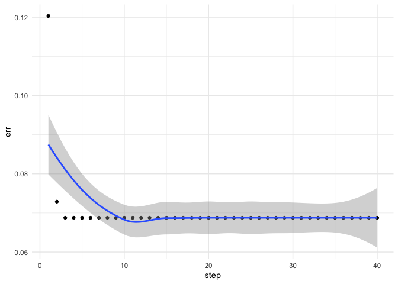

Banana Neural Networks Library (bnnlib)
=======================================

`bnnlib` is a library for neural networks covering (deep) recurrent
networks with long-short-term-memory (LSTM) cells. The library is
written in C++ and offers R-bindings via a SWIG interface.

The library is not optimized for speed but for flexibility in developing
new architectures. Unlike modern implementation, it does not rely on
optimized matrix algebra but simple activation propagation across sets
of nodes, which in turn are organized into ensembles. An ensemble
represents any collection of nodes, that is, either a complex node type
(like a LSTM cell) or a layer of cells.

The original code was written in 2008 and lied dormant for more than 10
years. It is now slowly revived as the ‘banana neural network library’.
The logo is from an anonymous contributor on publicdomainvectors.org
(<a href="https://publicdomainvectors.org/en/free-clipart/Vector-clip-art-of-square-peeled-banana/31874.html" class="uri">https://publicdomainvectors.org/en/free-clipart/Vector-clip-art-of-square-peeled-banana/31874.html</a>).
The logo was released under a public domain license in 2015.

Installation
============

\`bnnlib’ is written in C++ and needs to be compiled first. The
compilation requires a C++ compiler and the SWIG library to compile the
wrappers for R. A Unix-style Makefile is provided to generate the
wrappers and compile a shared library. In the terminal, run

    make all

You should find a shared object that can be loaded from R (e.g.,
`bnnlib.so` on Linux or macOS, or `bnnlib.dll` on Windows). Also, you
should find a library containing the R function definitions to wrap the
C++ calls, which is called `bnnlib.R`.

To make use of the full functionality of the library, the system should
also provide commands `gnuplot` and `dot` (from Graphviz).

Getting Started
===============

    dyn.load(paste("bnnlib", .Platform$dynlib.ext, sep=""))
    source("bnnlib.R")
    cacheMetaData(1)

Usage
=====

Create a Neural network
-----------------------

`bnnlib` has some factory functions to easily create standard
architectures of neural networks. This is a single hidden layer network
with LSTM cells (Schmidhuber & Hochreiter, 1997). The function takes
three arguments, the number of inputs nodes, the number of LSTM cells,
and the number of output nodes. The following network has a single input
node, two LSTM cells, and one output node:

    net <- LSTMNetwork(1,2,1)

Creating Training Data
----------------------

    seq <- SequenceSet()
    delay <- 10

    num.seq <- 5

    for (i in 1:num.seq) {
    len <- 50
    # create a sequence from scratch
    input <- rep(0,len)
    output <- rep(0,len)

    pos <- sample(1:40,1)
    cat(i,".: Position=",pos,"\n")
    input[pos]<-1
    output[pos+delay]<-1

    seq1<-Sequence(input,output,len)

    SequenceSet_add_sequence(seq,seq1)

    }

    ## 1 .: Position= 22 
    ## 2 .: Position= 2 
    ## 3 .: Position= 13 
    ## 4 .: Position= 1 
    ## 5 .: Position= 30

Creating a Trainer
------------------

There are different training algorithms available that mostly are
different flavors of back-propagation.

    bp <- ImprovedRPropTrainer(net)

Start the Training
------------------

    iterations <- 40
    steps.per.iteration <- 500
    err <- rep(NA, iterations)
    for (i in 1:iterations) {
      Trainer_train__SWIG_0(bp, seq, steps.per.iteration)
      err[i] <- Network_evaluate_training_error__SWIG_0(net, seq)
    }

With ggplot2, we can plot the training set error over iterations:

    library(ggplot2)
    ggplot(data=data.frame(step=1:iterations,err),aes(x=step,y=err))+
      geom_point()+
      geom_smooth()+
      theme_minimal()

Export Network
--------------

`bnnlib` supports export of network diagrams. THis requires external
libraries to render Graphviz files, e.g., the DOT package in R.

    library(DOT)
    Network_export_to_dot_graph(net,"testfile.ps")

    ## NULL

    lines <- paste0(readLines("testfile.dot"),sep="",collapse="")
    DOT::dot(lines,file="img/testfile.svg")

    ## <?xml version="1.0" encoding="UTF-8" standalone="no"?>
    ## <!DOCTYPE svg PUBLIC "-//W3C//DTD SVG 1.1//EN"
    ##  "http://www.w3.org/Graphics/SVG/1.1/DTD/svg11.dtd">
    ## <!-- Generated by graphviz version 2.38.0 (20140413.2041)
    ##  -->
    ## <!-- Title: G Pages: 1 -->
    ## <svg width="1983pt" height="791pt"
    ##  viewBox="0.00 0.00 1982.50 790.80" xmlns="http://www.w3.org/2000/svg" xmlns:xlink="http://www.w3.org/1999/xlink">
    ## <g id="graph0" class="graph" transform="scale(1 1) rotate(0) translate(4 786.8)">
    ## <title>G</title>
    ## <polygon fill="white" stroke="none" points="-4,4 -4,-786.8 1978.5,-786.8 1978.5,4 -4,4"/>
    ## <g id="clust1" class="cluster"><title>cluster_0</title>
    ## <polygon fill="none" stroke="black" points="8,-208.4 8,-285.2 154,-285.2 154,-208.4 8,-208.4"/>
    ## <text text-anchor="middle" x="81" y="-268.6" font-family="Times,serif" font-size="14.00">Feedforward Ensemble</text>
    ## </g>
    ## <g id="clust2" class="cluster"><title>cluster_1</title>
    ## <polygon fill="none" stroke="black" points="1558,-698 1558,-774.8 1704,-774.8 1704,-698 1558,-698"/>
    ## <text text-anchor="middle" x="1631" y="-758.2" font-family="Times,serif" font-size="14.00">Feedforward Ensemble</text>
    ## </g>
    ## <g id="clust3" class="cluster"><title>cluster_2</title>
    ## <polygon fill="none" stroke="black" points="169,-8 169,-663.2 580,-663.2 580,-8 169,-8"/>
    ## <text text-anchor="middle" x="374.5" y="-646.6" font-family="Times,serif" font-size="14.00">LSTMForgetEnsemble</text>
    ## </g>
    ## <g id="clust4" class="cluster"><title>cluster_3</title>
    ## <polygon fill="none" stroke="black" points="1049,-8 1049,-663.2 1469,-663.2 1469,-8 1049,-8"/>
    ## <text text-anchor="middle" x="1259" y="-646.6" font-family="Times,serif" font-size="14.00">LSTMForgetEnsemble</text>
    ## </g>
    ## <g id="clust5" class="cluster"><title>cluster_4</title>
    ## <polygon fill="none" stroke="black" points="620,-96.8 620,-173.6 766,-173.6 766,-96.8 620,-96.8"/>
    ## <text text-anchor="middle" x="693" y="-157" font-family="Times,serif" font-size="14.00">Feedforward Ensemble</text>
    ## </g>
    ## <!-- n0 -->
    ## <g id="node1" class="node"><title>n0</title>
    ## <ellipse fill="white" stroke="black" cx="94" cy="-234.4" rx="44.0795" ry="18"/>
    ## <text text-anchor="middle" x="94" y="-230.2" font-family="Times,serif" font-size="14.00">Bias &#160;[0]</text>
    ## </g>
    ## <!-- n22 -->
    ## <g id="node23" class="node"><title>n22</title>
    ## <ellipse fill="white" stroke="black" cx="693" cy="-122.8" rx="56.7464" ry="18"/>
    ## <text text-anchor="middle" x="693" y="-118.6" font-family="Times,serif" font-size="14.00">Tanh45[22]</text>
    ## </g>
    ## <!-- n0&#45;&gt;n22 -->
    ## <g id="edge1" class="edge"><title>n0&#45;&gt;n22</title>
    ## <path fill="none" stroke="black" d="M90.2404,-216.439C88.7766,-204.901 89.2558,-190.217 98.5,-181.6 108.366,-172.403 570.845,-176.577 584,-173.6 610.338,-167.641 637.988,-154.923 658.849,-143.832"/>
    ## <polygon fill="black" stroke="black" points="660.532,-146.9 667.638,-139.042 657.182,-140.754 660.532,-146.9"/>
    ## <text text-anchor="middle" x="133.25" y="-185.8" font-family="Times,serif" font-size="14.00">0.00364216</text>
    ## </g>
    ## <!-- n3 -->
    ## <g id="node2" class="node"><title>n3</title>
    ## <ellipse fill="white" stroke="black" cx="1631" cy="-724" rx="45.2266" ry="18"/>
    ## <text text-anchor="middle" x="1631" y="-719.8" font-family="Times,serif" font-size="14.00">Lin24[3]</text>
    ## </g>
    ## <!-- n7 -->
    ## <g id="node4" class="node"><title>n7</title>
    ## <ellipse fill="white" stroke="black" cx="400" cy="-612.4" rx="45.7848" ry="18"/>
    ## <text text-anchor="middle" x="400" y="-608.2" font-family="Times,serif" font-size="14.00">ingate[7]</text>
    ## </g>
    ## <!-- n3&#45;&gt;n7 -->
    ## <g id="edge3" class="edge"><title>n3&#45;&gt;n7</title>
    ## <path fill="none" stroke="black" d="M1585.77,-722.491C1382.73,-719.967 560.799,-707.099 455,-663.2 441.669,-657.669 429.471,-647.439 419.969,-637.684"/>
    ## <polygon fill="black" stroke="black" points="422.302,-635.05 412.955,-630.061 417.15,-639.79 422.302,-635.05"/>
    ## <text text-anchor="middle" x="632.08" y="-675.4" font-family="Times,serif" font-size="14.00">&#45;0.0130187</text>
    ## </g>
    ## <!-- n8 -->
    ## <g id="node5" class="node"><title>n8</title>
    ## <ellipse fill="white" stroke="black" cx="408" cy="-122.8" rx="61.3742" ry="18"/>
    ## <text text-anchor="middle" x="408" y="-118.6" font-family="Times,serif" font-size="14.00">forgetgate[8]</text>
    ## </g>
    ## <!-- n3&#45;&gt;n8 -->
    ## <g id="edge4" class="edge"><title>n3&#45;&gt;n8</title>
    ## <path fill="none" stroke="black" d="M1620.44,-706.265C1608.29,-685.371 1590,-648.14 1590,-613.4 1590,-613.4 1590,-613.4 1590,-233.4 1590,-193.979 1555.47,-193.839 1518,-181.6 1463.13,-163.679 533.978,-191.192 479,-173.6 462.061,-168.18 445.637,-157.159 432.86,-146.859"/>
    ## <polygon fill="black" stroke="black" points="434.926,-144.023 425.021,-140.261 430.418,-149.379 434.926,-144.023"/>
    ## <text text-anchor="middle" x="1612.75" y="-430.6" font-family="Times,serif" font-size="14.00">1599.98</text>
    ## </g>
    ## <!-- n15 -->
    ## <g id="node6" class="node"><title>n15</title>
    ## <ellipse fill="white" stroke="black" cx="273" cy="-122.8" rx="55.5985" ry="18"/>
    ## <text text-anchor="middle" x="273" y="-118.6" font-family="Times,serif" font-size="14.00">outgate[15]</text>
    ## </g>
    ## <!-- n3&#45;&gt;n15 -->
    ## <g id="edge5" class="edge"><title>n3&#45;&gt;n15</title>
    ## <path fill="none" stroke="black" d="M1598.62,-711.385C1561,-695.561 1504,-663.347 1504,-613.4 1504,-613.4 1504,-613.4 1504,-233.4 1504,-206.57 1496.29,-194.915 1473,-181.6 1445.63,-165.954 367.823,-183.829 338,-173.6 322.267,-168.204 307.338,-157.338 295.764,-147.129"/>
    ## <polygon fill="black" stroke="black" points="298.036,-144.463 288.319,-140.242 293.283,-149.602 298.036,-144.463"/>
    ## <text text-anchor="middle" x="1529.08" y="-430.6" font-family="Times,serif" font-size="14.00">&#45;0.59561</text>
    ## </g>
    ## <!-- n6 -->
    ## <g id="node7" class="node"><title>n6</title>
    ## <ellipse fill="white" stroke="black" cx="530" cy="-122.8" rx="42.2952" ry="18"/>
    ## <text text-anchor="middle" x="530" y="-118.6" font-family="Times,serif" font-size="14.00">input[6]</text>
    ## </g>
    ## <!-- n3&#45;&gt;n6 -->
    ## <g id="edge2" class="edge"><title>n3&#45;&gt;n6</title>
    ## <path fill="none" stroke="black" d="M1641.56,-706.265C1653.71,-685.371 1672,-648.14 1672,-613.4 1672,-613.4 1672,-613.4 1672,-233.4 1672,-195.408 1639.95,-193.895 1604,-181.6 1552.06,-163.837 668.953,-188.055 616,-173.6 594.935,-167.849 573.678,-155.613 557.569,-144.709"/>
    ## <polygon fill="black" stroke="black" points="559.381,-141.706 549.182,-138.838 555.367,-147.44 559.381,-141.706"/>
    ## <text text-anchor="middle" x="1698.25" y="-430.6" font-family="Times,serif" font-size="14.00">0.184389</text>
    ## </g>
    ## <!-- n5 -->
    ## <g id="node14" class="node"><title>n5</title>
    ## <ellipse fill="white" stroke="black" cx="1255" cy="-612.4" rx="45.7848" ry="18"/>
    ## <text text-anchor="middle" x="1255" y="-608.2" font-family="Times,serif" font-size="14.00">ingate[5]</text>
    ## </g>
    ## <!-- n3&#45;&gt;n5 -->
    ## <g id="edge7" class="edge"><title>n3&#45;&gt;n5</title>
    ## <path fill="none" stroke="black" d="M1586.67,-719.733C1526.66,-714.085 1417.18,-699.392 1331,-663.2 1313.78,-655.967 1296.22,-644.769 1282.33,-634.822"/>
    ## <polygon fill="black" stroke="black" points="1284.32,-631.941 1274.19,-628.838 1280.18,-637.581 1284.32,-631.941"/>
    ## <text text-anchor="middle" x="1425.75" y="-675.4" font-family="Times,serif" font-size="14.00">82360.2</text>
    ## </g>
    ## <!-- n11 -->
    ## <g id="node15" class="node"><title>n11</title>
    ## <ellipse fill="white" stroke="black" cx="1273" cy="-122.8" rx="66.0319" ry="18"/>
    ## <text text-anchor="middle" x="1273" y="-118.6" font-family="Times,serif" font-size="14.00">forgetgate[11]</text>
    ## </g>
    ## <!-- n3&#45;&gt;n11 -->
    ## <g id="edge8" class="edge"><title>n3&#45;&gt;n11</title>
    ## <path fill="none" stroke="black" d="M1675.23,-719.948C1738.43,-712.914 1847,-689.723 1847,-613.4 1847,-613.4 1847,-613.4 1847,-233.4 1847,-193.979 1812.41,-194.045 1775,-181.6 1729.97,-166.619 1393.3,-187.734 1348,-173.6 1330.21,-168.048 1312.72,-156.863 1299.11,-146.497"/>
    ## <polygon fill="black" stroke="black" points="1301.18,-143.673 1291.17,-140.206 1296.83,-149.16 1301.18,-143.673"/>
    ## <text text-anchor="middle" x="1869.75" y="-430.6" font-family="Times,serif" font-size="14.00">1599.96</text>
    ## </g>
    ## <!-- n18 -->
    ## <g id="node16" class="node"><title>n18</title>
    ## <ellipse fill="white" stroke="black" cx="1113" cy="-122.8" rx="55.5985" ry="18"/>
    ## <text text-anchor="middle" x="1113" y="-118.6" font-family="Times,serif" font-size="14.00">outgate[18]</text>
    ## </g>
    ## <!-- n3&#45;&gt;n18 -->
    ## <g id="edge9" class="edge"><title>n3&#45;&gt;n18</title>
    ## <path fill="none" stroke="black" d="M1664.14,-711.607C1702.66,-696.01 1761,-664.027 1761,-613.4 1761,-613.4 1761,-613.4 1761,-233.4 1761,-192.889 1724.57,-193.974 1686,-181.6 1634.36,-165.035 1250.22,-188.231 1198,-173.6 1177.71,-167.916 1157.27,-156.171 1141.51,-145.514"/>
    ## <polygon fill="black" stroke="black" points="1143.48,-142.615 1133.28,-139.751 1139.46,-148.351 1143.48,-142.615"/>
    ## <text text-anchor="middle" x="1786.08" y="-430.6" font-family="Times,serif" font-size="14.00">&#45;15.9338</text>
    ## </g>
    ## <!-- n4 -->
    ## <g id="node17" class="node"><title>n4</title>
    ## <ellipse fill="white" stroke="black" cx="1399" cy="-122.8" rx="42.2952" ry="18"/>
    ## <text text-anchor="middle" x="1399" y="-118.6" font-family="Times,serif" font-size="14.00">input[4]</text>
    ## </g>
    ## <!-- n3&#45;&gt;n4 -->
    ## <g id="edge6" class="edge"><title>n3&#45;&gt;n4</title>
    ## <path fill="none" stroke="black" d="M1675.16,-719.795C1732.7,-715.024 1829.66,-704.769 1861,-688 1900.56,-666.834 1929,-658.263 1929,-613.4 1929,-613.4 1929,-613.4 1929,-233.4 1929,-136.559 1585.38,-124.612 1451.5,-123.632"/>
    ## <polygon fill="black" stroke="black" points="1451.5,-120.132 1441.48,-123.577 1451.46,-127.132 1451.5,-120.132"/>
    ## <text text-anchor="middle" x="1951.75" y="-430.6" font-family="Times,serif" font-size="14.00">2901.83</text>
    ## </g>
    ## <!-- n1 -->
    ## <g id="node3" class="node"><title>n1</title>
    ## <ellipse fill="white" stroke="black" cx="518" cy="-612.4" rx="54.4681" ry="18"/>
    ## <text text-anchor="middle" x="518" y="-608.2" font-family="Times,serif" font-size="14.00">lstmbias[1]</text>
    ## </g>
    ## <!-- n10 -->
    ## <g id="node8" class="node"><title>n10</title>
    ## <ellipse fill="white" stroke="black" cx="400" cy="-523.6" rx="57.3437" ry="18"/>
    ## <text text-anchor="middle" x="400" y="-519.4" font-family="Times,serif" font-size="14.00">in_mult[10]</text>
    ## </g>
    ## <!-- n7&#45;&gt;n10 -->
    ## <g id="edge13" class="edge"><title>n7&#45;&gt;n10</title>
    ## <path fill="none" stroke="black" d="M400,-594.251C400,-582.125 400,-565.619 400,-551.719"/>
    ## <polygon fill="black" stroke="black" points="403.5,-551.713 400,-541.713 396.5,-551.713 403.5,-551.713"/>
    ## <text text-anchor="middle" x="403.5" y="-563.8" font-family="Times,serif" font-size="14.00">1</text>
    ## </g>
    ## <!-- n9 -->
    ## <g id="node9" class="node"><title>n9</title>
    ## <ellipse fill="white" stroke="black" cx="225" cy="-34" rx="48.0916" ry="18"/>
    ## <text text-anchor="middle" x="225" y="-29.8" font-family="Times,serif" font-size="14.00">f_mult[9]</text>
    ## </g>
    ## <!-- n8&#45;&gt;n9 -->
    ## <g id="edge14" class="edge"><title>n8&#45;&gt;n9</title>
    ## <path fill="none" stroke="black" d="M376.957,-107.076C345.358,-92.0879 296.349,-68.8419 262.577,-52.8232"/>
    ## <polygon fill="black" stroke="black" points="264.017,-49.6329 253.482,-48.5096 261.018,-55.9575 264.017,-49.6329"/>
    ## <text text-anchor="middle" x="336.5" y="-74.2" font-family="Times,serif" font-size="14.00">1</text>
    ## </g>
    ## <!-- n21 -->
    ## <g id="node12" class="node"><title>n21</title>
    ## <ellipse fill="white" stroke="black" cx="478" cy="-234.4" rx="54.4759" ry="18"/>
    ## <text text-anchor="middle" x="478" y="-230.2" font-family="Times,serif" font-size="14.00">o_mult[21]</text>
    ## </g>
    ## <!-- n15&#45;&gt;n21 -->
    ## <g id="edge25" class="edge"><title>n15&#45;&gt;n21</title>
    ## <path fill="none" stroke="black" d="M273.69,-140.992C275.342,-158.11 280.609,-183.87 297,-198.4 314.423,-213.845 370.508,-223.039 415.679,-228.099"/>
    ## <polygon fill="black" stroke="black" points="415.403,-231.59 425.72,-229.177 416.15,-224.63 415.403,-231.59"/>
    ## <text text-anchor="middle" x="300.5" y="-185.8" font-family="Times,serif" font-size="14.00">1</text>
    ## </g>
    ## <!-- n6&#45;&gt;n10 -->
    ## <g id="edge12" class="edge"><title>n6&#45;&gt;n10</title>
    ## <path fill="none" stroke="black" d="M517.788,-140.104C508.281,-151.499 494.036,-165.989 478,-173.6 464.852,-179.84 422.642,-170.699 413,-181.6 408.053,-187.193 412.914,-190.934 413,-198.4 413.444,-236.985 405.702,-247.749 415,-285.2 415.958,-289.058 418.087,-289.331 419,-293.2 435.964,-365.062 418.544,-452.689 407.535,-495.891"/>
    ## <polygon fill="black" stroke="black" points="404.131,-495.076 404.966,-505.638 410.899,-496.86 404.131,-495.076"/>
    ## <text text-anchor="middle" x="430.5" y="-341.8" font-family="Times,serif" font-size="14.00">1</text>
    ## </g>
    ## <!-- n12 -->
    ## <g id="node10" class="node"><title>n12</title>
    ## <ellipse fill="white" stroke="black" cx="272" cy="-434.8" rx="45.806" ry="18"/>
    ## <text text-anchor="middle" x="272" y="-430.6" font-family="Times,serif" font-size="14.00">CEC[12]</text>
    ## </g>
    ## <!-- n10&#45;&gt;n12 -->
    ## <g id="edge16" class="edge"><title>n10&#45;&gt;n12</title>
    ## <path fill="none" stroke="black" d="M377.116,-507.082C356.329,-492.986 325.508,-472.085 302.608,-456.556"/>
    ## <polygon fill="black" stroke="black" points="304.498,-453.609 294.257,-450.893 300.569,-459.402 304.498,-453.609"/>
    ## <text text-anchor="middle" x="351.5" y="-475" font-family="Times,serif" font-size="14.00">1</text>
    ## </g>
    ## <!-- n9&#45;&gt;n12 -->
    ## <g id="edge15" class="edge"><title>n9&#45;&gt;n12</title>
    ## <path fill="none" stroke="black" d="M218.976,-52.0577C214.974,-64.326 210.085,-81.3613 208,-96.8 203.432,-130.626 204.217,-139.677 208,-173.6 217.615,-259.819 231.726,-279.415 251,-364 254.526,-379.473 254.45,-383.596 259,-398.8 259.836,-401.594 260.78,-404.488 261.768,-407.359"/>
    ## <polygon fill="black" stroke="black" points="258.512,-408.647 265.204,-416.86 265.095,-406.266 258.512,-408.647"/>
    ## <text text-anchor="middle" x="234.5" y="-230.2" font-family="Times,serif" font-size="14.00">1</text>
    ## </g>
    ## <!-- n12&#45;&gt;n7 -->
    ## <g id="edge20" class="edge"><title>n12&#45;&gt;n7</title>
    ## <path fill="none" stroke="grey" d="M269.519,-453.08C267.242,-475.384 266.469,-514.535 283.839,-541.6 300.573,-567.673 330.825,-585.391 356.261,-596.451"/>
    ## <polygon fill="grey" stroke="grey" points="355.157,-599.782 365.736,-600.367 357.831,-593.313 355.157,-599.782"/>
    ## <text text-anchor="middle" x="309.08" y="-519.4" font-family="Times,serif" font-size="14.00">&#45;3.08825</text>
    ## </g>
    ## <!-- n12&#45;&gt;n8 -->
    ## <g id="edge22" class="edge"><title>n12&#45;&gt;n8</title>
    ## <path fill="none" stroke="grey" d="M269.84,-416.584C267.909,-394.692 267.312,-356.338 282,-328 287.657,-317.086 296.657,-320.53 303,-310 333.187,-259.885 300.362,-230.812 332,-181.6 337.855,-172.493 357.522,-157.631 375.382,-145.258"/>
    ## <polygon fill="grey" stroke="grey" points="377.649,-147.948 383.935,-139.42 373.703,-142.167 377.649,-147.948"/>
    ## <text text-anchor="middle" x="334.75" y="-297.4" font-family="Times,serif" font-size="14.00">1.71298</text>
    ## </g>
    ## <!-- n12&#45;&gt;n15 -->
    ## <g id="edge21" class="edge"><title>n12&#45;&gt;n15</title>
    ## <path fill="none" stroke="black" d="M268.496,-416.673C263.821,-392.871 255.792,-348.382 252.839,-310 248.47,-253.199 259.524,-186.931 266.937,-150.76"/>
    ## <polygon fill="black" stroke="black" points="270.364,-151.474 269.008,-140.966 263.515,-150.026 270.364,-151.474"/>
    ## <text text-anchor="middle" x="278.08" y="-297.4" font-family="Times,serif" font-size="14.00">&#45;16.4273</text>
    ## </g>
    ## <!-- n12&#45;&gt;n9 -->
    ## <g id="edge18" class="edge"><title>n12&#45;&gt;n9</title>
    ## <path fill="none" stroke="grey" d="M260.8,-416.897C243.919,-390.256 212.782,-336.262 202,-285.2 184.701,-203.272 193.289,-180.179 201,-96.8 202.116,-84.7349 201.949,-81.4194 206,-70 207.11,-66.8723 208.471,-63.6869 209.951,-60.5756"/>
    ## <polygon fill="grey" stroke="grey" points="213.112,-62.0832 214.612,-51.5951 206.899,-58.8583 213.112,-62.0832"/>
    ## <text text-anchor="middle" x="205.5" y="-230.2" font-family="Times,serif" font-size="14.00">1</text>
    ## </g>
    ## <!-- n16 -->
    ## <g id="node11" class="node"><title>n16</title>
    ## <ellipse fill="white" stroke="black" cx="348" cy="-346" rx="56.7464" ry="18"/>
    ## <text text-anchor="middle" x="348" y="-341.8" font-family="Times,serif" font-size="14.00">Tanh33[16]</text>
    ## </g>
    ## <!-- n12&#45;&gt;n16 -->
    ## <g id="edge19" class="edge"><title>n12&#45;&gt;n16</title>
    ## <path fill="none" stroke="black" d="M286.295,-417.474C297.687,-404.463 313.811,-386.047 326.72,-371.304"/>
    ## <polygon fill="black" stroke="black" points="329.556,-373.378 333.511,-363.548 324.29,-368.766 329.556,-373.378"/>
    ## <text text-anchor="middle" x="320.5" y="-386.2" font-family="Times,serif" font-size="14.00">1</text>
    ## </g>
    ## <!-- n16&#45;&gt;n21 -->
    ## <g id="edge26" class="edge"><title>n16&#45;&gt;n21</title>
    ## <path fill="none" stroke="black" d="M367.182,-328.828C389.36,-310.13 426.019,-279.224 451.053,-258.119"/>
    ## <polygon fill="black" stroke="black" points="453.35,-260.76 458.739,-251.638 448.838,-255.408 453.35,-260.76"/>
    ## <text text-anchor="middle" x="413.5" y="-297.4" font-family="Times,serif" font-size="14.00">1</text>
    ## </g>
    ## <!-- n21&#45;&gt;n7 -->
    ## <g id="edge45" class="edge"><title>n21&#45;&gt;n7</title>
    ## <path fill="none" stroke="grey" d="M478,-252.486C478,-274.047 478,-312.272 478,-345 478,-524.6 478,-524.6 478,-524.6 478,-553.038 454.55,-576.386 433.365,-591.677"/>
    ## <polygon fill="grey" stroke="grey" points="431.381,-588.794 425.109,-597.333 435.337,-594.569 431.381,-588.794"/>
    ## <text text-anchor="middle" x="503.08" y="-430.6" font-family="Times,serif" font-size="14.00">&#45;114.368</text>
    ## </g>
    ## <!-- n21&#45;&gt;n8 -->
    ## <g id="edge46" class="edge"><title>n21&#45;&gt;n8</title>
    ## <path fill="none" stroke="grey" d="M447.688,-219.23C439.032,-213.834 430.367,-206.893 424.5,-198.4 414.975,-184.613 410.832,-166.265 409.08,-151.216"/>
    ## <polygon fill="grey" stroke="grey" points="412.541,-150.611 408.183,-140.954 405.567,-151.22 412.541,-150.611"/>
    ## <text text-anchor="middle" x="447.75" y="-185.8" font-family="Times,serif" font-size="14.00">6.21823</text>
    ## </g>
    ## <!-- n21&#45;&gt;n15 -->
    ## <g id="edge47" class="edge"><title>n21&#45;&gt;n15</title>
    ## <path fill="none" stroke="grey" d="M432.889,-224.117C410.934,-218.512 384.641,-210.141 362.839,-198.4 337.764,-184.895 313.155,-163.747 296.052,-147.411"/>
    ## <polygon fill="grey" stroke="grey" points="298.35,-144.764 288.747,-140.289 293.464,-149.776 298.35,-144.764"/>
    ## <text text-anchor="middle" x="388.08" y="-185.8" font-family="Times,serif" font-size="14.00">&#45;70.6089</text>
    ## </g>
    ## <!-- n21&#45;&gt;n6 -->
    ## <g id="edge44" class="edge"><title>n21&#45;&gt;n6</title>
    ## <path fill="none" stroke="grey" d="M474.167,-216.021C472.687,-205.678 472.234,-192.49 476.5,-181.6 481.866,-167.904 492.169,-155.512 502.313,-145.746"/>
    ## <polygon fill="grey" stroke="grey" points="504.901,-148.124 509.955,-138.812 500.197,-142.94 504.901,-148.124"/>
    ## <text text-anchor="middle" x="503.25" y="-185.8" font-family="Times,serif" font-size="14.00">0.632197</text>
    ## </g>
    ## <!-- n21&#45;&gt;n5 -->
    ## <g id="edge49" class="edge"><title>n21&#45;&gt;n5</title>
    ## <path fill="none" stroke="grey" d="M529.135,-240.952C628.431,-251.496 854.346,-274.337 1045,-285.2 1078.85,-287.128 1317.65,-283.075 1350,-293.2 1390.07,-305.74 1429,-303.014 1429,-345 1429,-524.6 1429,-524.6 1429,-524.6 1429,-553.222 1352.66,-582.011 1301.11,-598.187"/>
    ## <polygon fill="grey" stroke="grey" points="1300,-594.865 1291.48,-601.154 1302.06,-601.554 1300,-594.865"/>
    ## <text text-anchor="middle" x="1448.25" y="-430.6" font-family="Times,serif" font-size="14.00">2904.7</text>
    ## </g>
    ## <!-- n21&#45;&gt;n11 -->
    ## <g id="edge50" class="edge"><title>n21&#45;&gt;n11</title>
    ## <path fill="none" stroke="grey" d="M532.28,-232.434C630.005,-230.108 831.477,-222.466 897,-198.4 909.052,-193.974 908.337,-185.71 920.5,-181.6 974.737,-163.273 1122.63,-188.149 1178,-173.6 1200.24,-167.757 1223.13,-155.965 1240.86,-145.322"/>
    ## <polygon fill="grey" stroke="grey" points="1242.97,-148.133 1249.64,-139.899 1239.29,-142.179 1242.97,-148.133"/>
    ## <text text-anchor="middle" x="943.75" y="-185.8" font-family="Times,serif" font-size="14.00">101.839</text>
    ## </g>
    ## <!-- n21&#45;&gt;n18 -->
    ## <g id="edge51" class="edge"><title>n21&#45;&gt;n18</title>
    ## <path fill="none" stroke="grey" d="M532.07,-231.403C615.673,-227.732 772.093,-218.384 824,-198.4 835.76,-193.872 835.354,-186.785 846.839,-181.6 912.77,-151.839 994.948,-137.006 1050.41,-129.888"/>
    ## <polygon fill="grey" stroke="grey" points="1050.95,-133.348 1060.45,-128.647 1050.09,-126.401 1050.95,-133.348"/>
    ## <text text-anchor="middle" x="872.08" y="-185.8" font-family="Times,serif" font-size="14.00">&#45;123.946</text>
    ## </g>
    ## <!-- n21&#45;&gt;n4 -->
    ## <g id="edge48" class="edge"><title>n21&#45;&gt;n4</title>
    ## <path fill="none" stroke="grey" d="M532.751,-233.766C643.249,-233.81 888.955,-230.194 966,-198.4 976.575,-194.036 974.821,-185.701 985.5,-181.6 1023.11,-167.159 1310.86,-189.206 1348,-173.6 1360.66,-168.282 1371.92,-158.221 1380.62,-148.526"/>
    ## <polygon fill="grey" stroke="grey" points="1383.55,-150.488 1387.3,-140.581 1378.19,-145.982 1383.55,-150.488"/>
    ## <text text-anchor="middle" x="1008.75" y="-185.8" font-family="Times,serif" font-size="14.00">9.24907</text>
    ## </g>
    ## <!-- n21&#45;&gt;n22 -->
    ## <g id="edge43" class="edge"><title>n21&#45;&gt;n22</title>
    ## <path fill="none" stroke="black" d="M530.984,-229.964C580.846,-225.666 650.794,-216.545 671,-198.4 684.142,-186.598 689.598,-167.379 691.791,-151.404"/>
    ## <polygon fill="black" stroke="black" points="695.319,-151.295 692.842,-140.994 688.355,-150.592 695.319,-151.295"/>
    ## <text text-anchor="middle" x="709.08" y="-185.8" font-family="Times,serif" font-size="14.00">&#45;2.58858</text>
    ## </g>
    ## <!-- n2 -->
    ## <g id="node13" class="node"><title>n2</title>
    ## <ellipse fill="white" stroke="black" cx="1394" cy="-612.4" rx="54.4681" ry="18"/>
    ## <text text-anchor="middle" x="1394" y="-608.2" font-family="Times,serif" font-size="14.00">lstmbias[2]</text>
    ## </g>
    ## <!-- n14 -->
    ## <g id="node18" class="node"><title>n14</title>
    ## <ellipse fill="white" stroke="black" cx="1255" cy="-523.6" rx="57.3437" ry="18"/>
    ## <text text-anchor="middle" x="1255" y="-519.4" font-family="Times,serif" font-size="14.00">in_mult[14]</text>
    ## </g>
    ## <!-- n5&#45;&gt;n14 -->
    ## <g id="edge11" class="edge"><title>n5&#45;&gt;n14</title>
    ## <path fill="none" stroke="black" d="M1255,-594.251C1255,-582.125 1255,-565.619 1255,-551.719"/>
    ## <polygon fill="black" stroke="black" points="1258.5,-551.713 1255,-541.713 1251.5,-551.713 1258.5,-551.713"/>
    ## <text text-anchor="middle" x="1258.5" y="-563.8" font-family="Times,serif" font-size="14.00">1</text>
    ## </g>
    ## <!-- n13 -->
    ## <g id="node19" class="node"><title>n13</title>
    ## <ellipse fill="white" stroke="black" cx="1273" cy="-34" rx="52.7488" ry="18"/>
    ## <text text-anchor="middle" x="1273" y="-29.8" font-family="Times,serif" font-size="14.00">f_mult[13]</text>
    ## </g>
    ## <!-- n11&#45;&gt;n13 -->
    ## <g id="edge17" class="edge"><title>n11&#45;&gt;n13</title>
    ## <path fill="none" stroke="black" d="M1273,-104.651C1273,-92.5249 1273,-76.019 1273,-62.119"/>
    ## <polygon fill="black" stroke="black" points="1276.5,-62.1132 1273,-52.1133 1269.5,-62.1133 1276.5,-62.1132"/>
    ## <text text-anchor="middle" x="1276.5" y="-74.2" font-family="Times,serif" font-size="14.00">1</text>
    ## </g>
    ## <!-- n20 -->
    ## <g id="node22" class="node"><title>n20</title>
    ## <ellipse fill="white" stroke="black" cx="1137" cy="-234.4" rx="54.4759" ry="18"/>
    ## <text text-anchor="middle" x="1137" y="-230.2" font-family="Times,serif" font-size="14.00">o_mult[20]</text>
    ## </g>
    ## <!-- n18&#45;&gt;n20 -->
    ## <g id="edge32" class="edge"><title>n18&#45;&gt;n20</title>
    ## <path fill="none" stroke="black" d="M1116.72,-140.805C1120.55,-158.293 1126.58,-185.793 1131.06,-206.287"/>
    ## <polygon fill="black" stroke="black" points="1127.69,-207.255 1133.25,-216.275 1134.53,-205.758 1127.69,-207.255"/>
    ## <text text-anchor="middle" x="1133.5" y="-185.8" font-family="Times,serif" font-size="14.00">1</text>
    ## </g>
    ## <!-- n4&#45;&gt;n14 -->
    ## <g id="edge10" class="edge"><title>n4&#45;&gt;n14</title>
    ## <path fill="none" stroke="black" d="M1399.15,-141.186C1398.96,-171.232 1396.53,-234.519 1381,-285.2 1367.59,-328.97 1300.71,-445.113 1270.21,-496.969"/>
    ## <polygon fill="black" stroke="black" points="1267.19,-495.194 1265.13,-505.585 1273.22,-498.75 1267.19,-495.194"/>
    ## <text text-anchor="middle" x="1366.5" y="-341.8" font-family="Times,serif" font-size="14.00">1</text>
    ## </g>
    ## <!-- n17 -->
    ## <g id="node20" class="node"><title>n17</title>
    ## <ellipse fill="white" stroke="black" cx="1238" cy="-434.8" rx="45.806" ry="18"/>
    ## <text text-anchor="middle" x="1238" y="-430.6" font-family="Times,serif" font-size="14.00">CEC[17]</text>
    ## </g>
    ## <!-- n14&#45;&gt;n17 -->
    ## <g id="edge24" class="edge"><title>n14&#45;&gt;n17</title>
    ## <path fill="none" stroke="black" d="M1251.64,-505.451C1249.27,-493.325 1246.03,-476.819 1243.31,-462.919"/>
    ## <polygon fill="black" stroke="black" points="1246.71,-462.054 1241.35,-452.913 1239.84,-463.4 1246.71,-462.054"/>
    ## <text text-anchor="middle" x="1252.5" y="-475" font-family="Times,serif" font-size="14.00">1</text>
    ## </g>
    ## <!-- n13&#45;&gt;n17 -->
    ## <g id="edge23" class="edge"><title>n13&#45;&gt;n17</title>
    ## <path fill="none" stroke="black" d="M1245.09,-49.5616C1228.04,-60.1408 1207.72,-76.2003 1198,-96.8 1183.44,-127.671 1175.39,-148.032 1198,-173.6 1217.28,-195.403 1242.95,-160.501 1263,-181.6 1297.26,-217.646 1269.22,-243.505 1271,-293.2 1271.27,-300.662 1271.97,-302.597 1271,-310 1266.53,-344.158 1255.39,-382.297 1247.29,-407.098"/>
    ## <polygon fill="black" stroke="black" points="1243.87,-406.267 1244.03,-416.861 1250.51,-408.483 1243.87,-406.267"/>
    ## <text text-anchor="middle" x="1284.5" y="-230.2" font-family="Times,serif" font-size="14.00">1</text>
    ## </g>
    ## <!-- n17&#45;&gt;n5 -->
    ## <g id="edge29" class="edge"><title>n17&#45;&gt;n5</title>
    ## <path fill="none" stroke="grey" d="M1208.92,-448.884C1172.39,-467.289 1116.96,-502.927 1138.84,-541.6 1154.04,-568.473 1184.19,-586.137 1209.95,-596.972"/>
    ## <polygon fill="grey" stroke="grey" points="1208.99,-600.355 1219.58,-600.795 1211.58,-593.85 1208.99,-600.355"/>
    ## <text text-anchor="middle" x="1164.08" y="-519.4" font-family="Times,serif" font-size="14.00">&#45;24.8643</text>
    ## </g>
    ## <!-- n17&#45;&gt;n11 -->
    ## <g id="edge31" class="edge"><title>n17&#45;&gt;n11</title>
    ## <path fill="none" stroke="grey" d="M1262.36,-419.461C1269.58,-413.948 1276.7,-406.981 1281,-398.8 1303.5,-355.953 1306.46,-229.063 1297,-181.6 1294.85,-170.811 1290.65,-159.515 1286.35,-149.8"/>
    ## <polygon fill="grey" stroke="grey" points="1289.5,-148.27 1282.09,-140.691 1283.15,-151.232 1289.5,-148.27"/>
    ## <text text-anchor="middle" x="1323.75" y="-297.4" font-family="Times,serif" font-size="14.00">11.7575</text>
    ## </g>
    ## <!-- n17&#45;&gt;n18 -->
    ## <g id="edge30" class="edge"><title>n17&#45;&gt;n18</title>
    ## <path fill="none" stroke="black" d="M1235.7,-416.483C1228.44,-362.697 1205.67,-200.963 1192,-181.6 1190.22,-179.072 1164.88,-160.707 1143.38,-145.347"/>
    ## <polygon fill="black" stroke="black" points="1145.26,-142.387 1135.08,-139.433 1141.2,-148.087 1145.26,-142.387"/>
    ## <text text-anchor="middle" x="1245.08" y="-297.4" font-family="Times,serif" font-size="14.00">&#45;2.48689</text>
    ## </g>
    ## <!-- n17&#45;&gt;n13 -->
    ## <g id="edge27" class="edge"><title>n17&#45;&gt;n13</title>
    ## <path fill="none" stroke="grey" d="M1263.45,-419.716C1272.48,-413.97 1282.3,-406.79 1290,-398.8 1315.72,-372.131 1311.83,-357.686 1334,-328 1340.4,-319.423 1343.27,-318.325 1350,-310 1397.24,-251.533 1426.62,-245.04 1450,-173.6 1460.62,-141.16 1469.76,-124.631 1450,-96.8 1424.12,-60.3465 1375.05,-45.22 1335.13,-39.0288"/>
    ## <polygon fill="grey" stroke="grey" points="1335.59,-35.5587 1325.2,-37.6398 1334.62,-42.4912 1335.59,-35.5587"/>
    ## <text text-anchor="middle" x="1439.5" y="-230.2" font-family="Times,serif" font-size="14.00">1</text>
    ## </g>
    ## <!-- n19 -->
    ## <g id="node21" class="node"><title>n19</title>
    ## <ellipse fill="white" stroke="black" cx="1151" cy="-346" rx="56.7464" ry="18"/>
    ## <text text-anchor="middle" x="1151" y="-341.8" font-family="Times,serif" font-size="14.00">Tanh43[19]</text>
    ## </g>
    ## <!-- n17&#45;&gt;n19 -->
    ## <g id="edge28" class="edge"><title>n17&#45;&gt;n19</title>
    ## <path fill="none" stroke="black" d="M1222.04,-417.88C1208.84,-404.709 1189.89,-385.804 1174.89,-370.83"/>
    ## <polygon fill="black" stroke="black" points="1177,-367.995 1167.45,-363.409 1172.05,-372.95 1177,-367.995"/>
    ## <text text-anchor="middle" x="1206.5" y="-386.2" font-family="Times,serif" font-size="14.00">1</text>
    ## </g>
    ## <!-- n19&#45;&gt;n20 -->
    ## <g id="edge33" class="edge"><title>n19&#45;&gt;n20</title>
    ## <path fill="none" stroke="black" d="M1148.81,-327.875C1146.57,-310.341 1143.06,-282.834 1140.45,-262.372"/>
    ## <polygon fill="black" stroke="black" points="1143.91,-261.881 1139.17,-252.405 1136.97,-262.768 1143.91,-261.881"/>
    ## <text text-anchor="middle" x="1150.5" y="-297.4" font-family="Times,serif" font-size="14.00">1</text>
    ## </g>
    ## <!-- n20&#45;&gt;n7 -->
    ## <g id="edge36" class="edge"><title>n20&#45;&gt;n7</title>
    ## <path fill="none" stroke="grey" d="M1167,-249.56C1192.89,-261.126 1231.59,-276.874 1267,-285.2 1285.04,-289.442 1334.03,-283.807 1350,-293.2 1366.2,-302.723 1368.41,-310.061 1374,-328 1378.76,-343.276 1376.82,-348.25 1374,-364 1369.6,-388.626 1362.08,-392.961 1354.5,-416.8 1337.09,-471.527 1355.04,-495.346 1321,-541.6 1303.85,-564.897 1293.69,-568.041 1266,-576.4 1179.71,-602.447 543.968,-579.953 455,-594.4 450.894,-595.067 446.669,-595.966 442.472,-597.005"/>
    ## <polygon fill="grey" stroke="grey" points="441.53,-593.634 432.801,-599.638 443.369,-600.388 441.53,-593.634"/>
    ## <text text-anchor="middle" x="1381.25" y="-430.6" font-family="Times,serif" font-size="14.00">0.232143</text>
    ## </g>
    ## <!-- n20&#45;&gt;n8 -->
    ## <g id="edge37" class="edge"><title>n20&#45;&gt;n8</title>
    ## <path fill="none" stroke="grey" d="M1082.26,-234.017C967.101,-234.616 703.655,-232.12 621.5,-198.4 610.917,-194.056 612.589,-185.929 602,-181.6 551.291,-160.871 530.677,-191.782 479,-173.6 462.339,-167.738 446.04,-156.792 433.268,-146.652"/>
    ## <polygon fill="grey" stroke="grey" points="435.356,-143.836 425.417,-140.166 430.898,-149.233 435.356,-143.836"/>
    ## <text text-anchor="middle" x="644.75" y="-185.8" font-family="Times,serif" font-size="14.00">19.9927</text>
    ## </g>
    ## <!-- n20&#45;&gt;n15 -->
    ## <g id="edge38" class="edge"><title>n20&#45;&gt;n15</title>
    ## <path fill="none" stroke="grey" d="M1082.44,-232.197C945.812,-228.897 596.393,-218.573 547.839,-198.4 537.479,-194.096 539.397,-185.814 529,-181.6 489.629,-165.644 377.938,-188.079 338,-173.6 322.472,-167.97 307.65,-157.193 296.091,-147.099"/>
    ## <polygon fill="grey" stroke="grey" points="298.385,-144.455 288.642,-140.293 293.664,-149.622 298.385,-144.455"/>
    ## <text text-anchor="middle" x="573.08" y="-185.8" font-family="Times,serif" font-size="14.00">&#45;10.4889</text>
    ## </g>
    ## <!-- n20&#45;&gt;n6 -->
    ## <g id="edge35" class="edge"><title>n20&#45;&gt;n6</title>
    ## <path fill="none" stroke="grey" d="M1083.35,-231.166C995.327,-227.028 824.301,-216.862 766.839,-198.4 752.717,-193.862 752.187,-185.934 738,-181.6 686.032,-165.725 667.988,-189.408 616,-173.6 595.387,-167.332 574.421,-155.33 558.351,-144.679"/>
    ## <polygon fill="grey" stroke="grey" points="560.191,-141.697 549.96,-138.945 556.242,-147.477 560.191,-141.697"/>
    ## <text text-anchor="middle" x="795.58" y="-185.8" font-family="Times,serif" font-size="14.00">&#45;0.621503</text>
    ## </g>
    ## <!-- n20&#45;&gt;n5 -->
    ## <g id="edge40" class="edge"><title>n20&#45;&gt;n5</title>
    ## <path fill="none" stroke="grey" d="M1120.71,-251.614C1102.34,-271.699 1075,-307.836 1075,-345 1075,-524.6 1075,-524.6 1075,-524.6 1075,-580.66 1146.71,-600.532 1199.61,-607.565"/>
    ## <polygon fill="grey" stroke="grey" points="1199.23,-611.045 1209.58,-608.771 1200.07,-604.095 1199.23,-611.045"/>
    ## <text text-anchor="middle" x="1097.75" y="-430.6" font-family="Times,serif" font-size="14.00">813.844</text>
    ## </g>
    ## <!-- n20&#45;&gt;n11 -->
    ## <g id="edge41" class="edge"><title>n20&#45;&gt;n11</title>
    ## <path fill="none" stroke="grey" d="M1162.55,-218.453C1172.05,-212.56 1182.76,-205.506 1192,-198.4 1212.45,-182.677 1233.84,-162.805 1249.5,-147.526"/>
    ## <polygon fill="grey" stroke="grey" points="1252.04,-149.944 1256.7,-140.432 1247.12,-144.958 1252.04,-149.944"/>
    ## <text text-anchor="middle" x="1236.75" y="-185.8" font-family="Times,serif" font-size="14.00">2.41268</text>
    ## </g>
    ## <!-- n20&#45;&gt;n18 -->
    ## <g id="edge42" class="edge"><title>n20&#45;&gt;n18</title>
    ## <path fill="none" stroke="grey" d="M1140.86,-216.413C1142.55,-206.208 1143.62,-193.029 1141,-181.6 1138.48,-170.596 1133.57,-159.255 1128.56,-149.565"/>
    ## <polygon fill="grey" stroke="grey" points="1131.47,-147.592 1123.6,-140.499 1125.33,-150.951 1131.47,-147.592"/>
    ## <text text-anchor="middle" x="1165.75" y="-185.8" font-family="Times,serif" font-size="14.00">3.06583</text>
    ## </g>
    ## <!-- n20&#45;&gt;n4 -->
    ## <g id="edge39" class="edge"><title>n20&#45;&gt;n4</title>
    ## <path fill="none" stroke="grey" d="M1178.79,-222.757C1235.99,-208.007 1333.29,-182.194 1348,-173.6 1359.52,-166.87 1370.38,-156.976 1379.1,-147.777"/>
    ## <polygon fill="grey" stroke="grey" points="1381.76,-150.056 1385.88,-140.297 1376.57,-145.354 1381.76,-150.056"/>
    ## <text text-anchor="middle" x="1353.25" y="-185.8" font-family="Times,serif" font-size="14.00">0.927377</text>
    ## </g>
    ## <!-- n20&#45;&gt;n22 -->
    ## <g id="edge34" class="edge"><title>n20&#45;&gt;n22</title>
    ## <path fill="none" stroke="black" d="M1106.95,-219.332C1093.92,-213.099 1078.53,-205.567 1064.84,-198.4 1051.36,-191.342 1049.35,-186.677 1035,-181.6 942.072,-148.717 828.147,-134.254 758.076,-128.099"/>
    ## <polygon fill="black" stroke="black" points="758.324,-124.608 748.064,-127.25 757.732,-131.583 758.324,-124.608"/>
    ## <text text-anchor="middle" x="1093.58" y="-185.8" font-family="Times,serif" font-size="14.00">&#45;0.649078</text>
    ## </g>
    ## </g>
    ## </svg>

Plotting the activations
------------------------

`bnnlib` can create plots of the node activations over time using
`gnuplot`. The following plot shows the LSTM CEC nodes’ activations over
time for a selected sequence:

    node_vec <- Network_get_nodes_with_name(net,"CEC")
    GnuplotGenerator_plot_activations(net, seq1, node_vec)

    ## NULL

Testing the Network
-------------------

TODO
