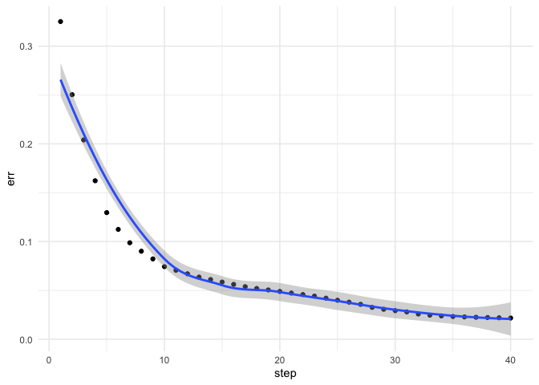

bnnlib
======

`bnnlib` is a library for neural networks written covering (deep)
recurrent networks with long-short-term-memory (LSTM) cells. The library
is written in C++ and offers R-bindings via a SWIG interface.

The original code was written in 2008 and lied dormant for more than 10
years. It is now slowly revived as the ‘banana neural network library’.
The logo is from an anonymous contributor on publicdomainvectors.org
(<a href="https://publicdomainvectors.org/en/free-clipart/Vector-clip-art-of-square-peeled-banana/31874.html" class="uri">https://publicdomainvectors.org/en/free-clipart/Vector-clip-art-of-square-peeled-banana/31874.html</a>).
The logo was released under a public domain license in 2015.

Setup
=====

    dyn.load(paste("bnnlib", .Platform$dynlib.ext, sep=""))
    source("bnnlib.R")
    cacheMetaData(1)

Usage
=====

Create a Neural network
-----------------------

`bnnlib` has some factory functions to easily create standard
architectures of neural networks. This is a single hidden layer network
with LSTM cells (Schmidhuber & Hochreiter, 1997). The function takes
three arguments, the number of inputs nodes, the number of LSTM cells,
and the number of output nodes. The following network has a single input
node, two LSTM cells, and one output node:

    net <- LSTMNetwork(1,2,1)

Creating Training Data
----------------------

    seq <- SequenceSet()
    delay <- 10

    num.seq <- 5

    for (i in 1:num.seq) {
    len <- 50
    # create a sequence from scratch
    input <- rep(0,len)
    output <- rep(0,len)

    pos <- runif(1,1,40)
    cat(i,".: Position=",pos,"\n")
    input[pos]<-1
    output[pos+delay]<-1

    seq1<-Sequence(input,output,len)

    SequenceSet_add_sequence(seq,seq1)

    }

    ## 1 .: Position= 7.487987 
    ## 2 .: Position= 2.737832 
    ## 3 .: Position= 17.47511 
    ## 4 .: Position= 16.41329 
    ## 5 .: Position= 12.94901

Creating a Trainer
------------------

There are different training algorithms available that mostly are
different flavors of back-propagation.

    bp <- ImprovedRPropTrainer(net)

Start the Training
------------------

    iterations <- 40
    steps.per.iteration <- 400
    err <- rep(NA, iterations)
    for (i in 1:iterations) {
      cat("Training the network for ", steps.per.iteration," steps\n")
      Trainer_train__SWIG_0(bp, seq, steps.per.iteration)
      err[i] <- Network_evaluate_training_error__SWIG_0(net, seq)
    }

    ## Training the network for  400  steps
    ## Training the network for  400  steps
    ## Training the network for  400  steps
    ## Training the network for  400  steps
    ## Training the network for  400  steps
    ## Training the network for  400  steps
    ## Training the network for  400  steps
    ## Training the network for  400  steps
    ## Training the network for  400  steps
    ## Training the network for  400  steps
    ## Training the network for  400  steps
    ## Training the network for  400  steps
    ## Training the network for  400  steps
    ## Training the network for  400  steps
    ## Training the network for  400  steps
    ## Training the network for  400  steps
    ## Training the network for  400  steps
    ## Training the network for  400  steps
    ## Training the network for  400  steps
    ## Training the network for  400  steps
    ## Training the network for  400  steps
    ## Training the network for  400  steps
    ## Training the network for  400  steps
    ## Training the network for  400  steps
    ## Training the network for  400  steps
    ## Training the network for  400  steps
    ## Training the network for  400  steps
    ## Training the network for  400  steps
    ## Training the network for  400  steps
    ## Training the network for  400  steps
    ## Training the network for  400  steps
    ## Training the network for  400  steps
    ## Training the network for  400  steps
    ## Training the network for  400  steps
    ## Training the network for  400  steps
    ## Training the network for  400  steps
    ## Training the network for  400  steps
    ## Training the network for  400  steps
    ## Training the network for  400  steps
    ## Training the network for  400  steps

With ggplot2, we can plot the training set error over iterations:

    require(ggplot2)
    ggplot(data=data.frame(step=1:iterations,err),aes(x=step,y=err))+
      geom_point()+
      geom_smooth()+
      theme_minimal()

Export Network
--------------

`bnnlib` supports export of network diagrams.

Plotting the activations
------------------------

`bnnlib` can create plots of the node activations over time using
`gnuplot`. The following plot shows the LSTM CEC nodes’ activations over
time for a selected sequence:

    node_vec <- Network_get_nodes_with_name(net,"CEC")
    GnuplotGenerator_plot_activations(net, seq1, node_vec)

    ## NULL

Testing the Network
-------------------

TODO
