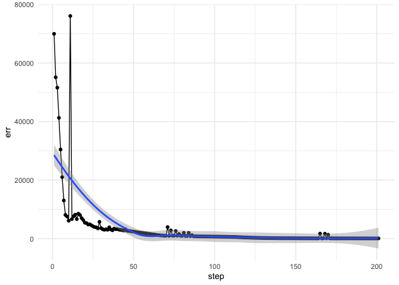

Feedforward Neural Network
--------------------------

Create a feed-forward neural network with 3 inputs, 25 hidden units, and
1 output. The output node is linear.

    LINEAR_NODE = 3

    net <- NetworkFactory_createFeedForwardNetwork(3,25,1, LINEAR_NODE)

Load the marketing dataset from the datarium package.

    data("marketing", package = "datarium")
    head(marketing, 4)

    ##   youtube facebook newspaper sales
    ## 1  276.12    45.36     83.04 26.52
    ## 2   53.40    47.16     54.12 12.48
    ## 3   20.64    55.08     83.16 11.16
    ## 4  181.80    49.56     70.20 22.20

Convert data to Sequence format

    sequence_set <- SequenceSet()

    source("../R/toSequence.R")
    seq <- toSequence(marketing, 1:3, 4)
    SequenceSet_add_copy_of_sequence(sequence_set,seq)

    ## NULL

    cat("Sequences created: ",SequenceSet_size(sequence_set),"\n")

    ## Sequences created:  1

    cat("Input size",SequenceSet_input_size_get(sequence_set),"\n")

    ## Input size 3

    cat("Target size",SequenceSet_target_size_get(sequence_set),"\n")

    ## Target size 1

Initialize training algorithm

    bp <- ImprovedRPropTrainer(net)

    cat("Using Trainer: ",Trainer_get_name(bp),"\n")

    ## Using Trainer:  IRProp-

Start training

    iterations <- 200
    steps.per.iteration <- 1
    err <- rep(NA, iterations+1)
    err[1] <- Network_evaluate_training_error__SWIG_0(net, sequence_set)
    for (i in 1:iterations) {
      Trainer_train__SWIG_0(bp, sequence_set, steps.per.iteration)
      err[i+1] <- Network_evaluate_training_error__SWIG_0(net, sequence_set)
    }

With ggplot2, we can plot the training set error over iterations:

    require(ggplot2)
    ggplot(data=data.frame(step=1:(iterations+1),err),aes(x=step,y=err))+
      geom_point()+ geom_line()+
      geom_smooth()+
      theme_minimal()

Inspect output:

    outputs <- getOutputs(net, seq)
    targets <- getTargets(seq)
    ggplot(data=data.frame(outputs=outputs, targets=targets), aes(y=outputs,x=targets))+
      geom_point()+
      theme_minimal()+
      xlab("Targets")+ylab("Predictions")+
      geom_smooth()+
      ggtitle("Sales")

    ## `geom_smooth()` using method = 'loess' and formula 'y ~ x'

