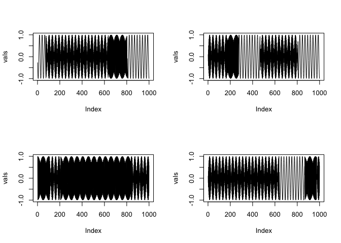
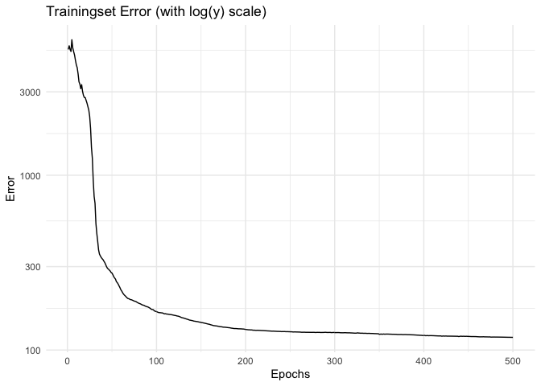
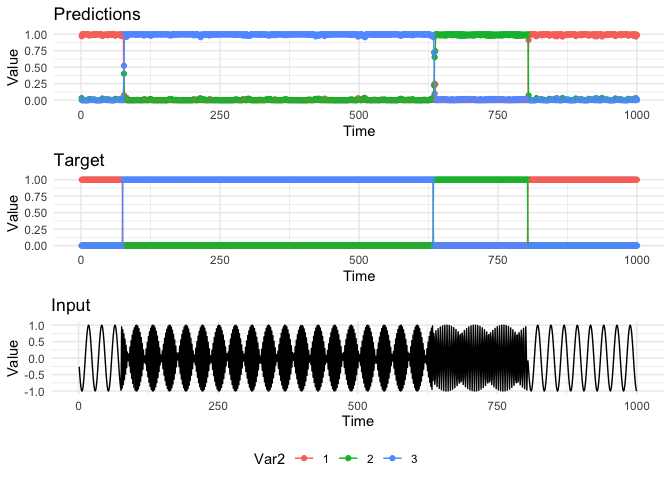
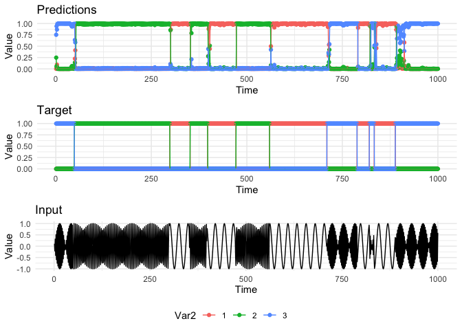

Setup
-----

First, we load the shared library, some packages, and extra R code.

    library(bnnlib)

    ## Loading required package: ggplot2

    ## Loading required package: gridExtra

    library(gridExtra)

Generate Frequency Data
-----------------------

We generate data from an oscillator that switches between three
different frequencies. The switches occur randomly at a chance of 1%
(and a switch may choose the identical frequency). We generate multiple
sequences each with a length of 1000.

    set.seed(123535)

    # simulate frequency data
    freqs = c(50, 77, 91)

    sim.frequencies <- function(freqs, ts.len = 1000, num.seqs = 4) {
      
     seqset <- SequenceSet() 
      
      num.freqs <- length(freqs)

      for (j in 1:num.seqs) {
        
        x <- 1:ts.len
        y<-rep(NA, ts.len)
        truth <- matrix(0, nrow=ts.len, ncol=length(freqs))
        
        freq <- sample(freqs,1)
        for (i in 1:ts.len) {
          y[i] <- sin(x[i]*freq)
          if (runif(1)>.99) {
            freq <- sample(freqs,1)
          }
          truth[i, which(freqs==freq)] <- 1
        }
        
        
        
        
        seqdf <- data.frame(y, truth)
        seq <- toSequence(seqdf, 1, 2:(1+num.freqs))
        
        
        SequenceSet_add_copy_of_sequence(seqset, seq)
      }
      
      return(seqset)
    }

    seqset <- sim.frequencies(freqs, num.seqs = 8)
    testset <- sim.frequencies(freqs)

Plot data from training set:

    plotinput <- function(index) {
    seq1<-SequenceSet_get(seqset,index-1)
    ln <- Sequence_size(seq1)
    vals <-  rep(NA, ln)
      for (i in 1:ln) {
            outp <- Sequence_get_input(seq1, i-1)
            vals[i] <- .Call('R_swig_toValue',  outp, package="bnnlib") 
      }
    plot(vals, type="l")
    }

    par(mfrow=c(2,2))
    plotinput(1)
    plotinput(2)
    plotinput(3)
    plotinput(4)

We set up a recurrent neural network with a winner-takes-all output
function that normalizes the sum of outputs to one and guarantuees that
each output is non-negative. The network has a total of three output
nodes, one for each possible frequency and learns to encode/predict the
probability with which each of the frequencies is “on”. Ideally, the
network should always select one of the outputs to be close to “1” and
the others “0” since this is a noise-free environment. From this task,
it is not possible to infer the occurence of a switch, so there will
always be some prediction error when a switch occurs but it should be
possible to quickly stabilize to the correct prediction.

    in_size <- 1
    out_size <- length(freqs)

    #hid_size = 20
    #network = LSTMNetwork(in_size,hid_size,out_size)

    network = NetworkFactory_createRecurrentWTANetwork(in_size=in_size, 
                                        hid_type=bnnlib::TANH_NODE, num_layers=2,
                                        layer_sizes=c(8,8),  
                                        out_size=out_size);

Initialize Trainer and set learning rate:

    trainer = ImprovedRPropTrainer(network);
    Trainer_learning_rate_set( trainer, 0.0001 )

    ## NULL

Train the network for 500 epochs.

    Trainer_train2(trainer, seqset, 500)

    ## NULL

    Trainer_add_abort_criterion(trainer, ConvergenceCriterion(0.01),10 )

    ## NULL

Plot the training error.

    x <- Trainer_error_train_get(trainer)

    library(ggplot2)
        values <- .Call('R_swig_toValue',  x, package="bnnlib") 
        ggplot(data.frame(x=1:length(values),values),aes(x=x,y=values))+geom_line()+
          theme_minimal()+ggtitle("Trainingset Error (with log(y) scale)")+
          xlab("Epochs")+
          ylab("Error")+
          scale_y_log10()

Predictions
-----------

Investigate the predictions on the training set. Extract predictions and
sequence information and store in matrices.

    seq1<-SequenceSet_get(seqset,0)

    plotPredictions(network, seq1)

Same on test set

    seq1 <- SequenceSet_get(testset, 0)
    plotPredictions(network, seq1)

