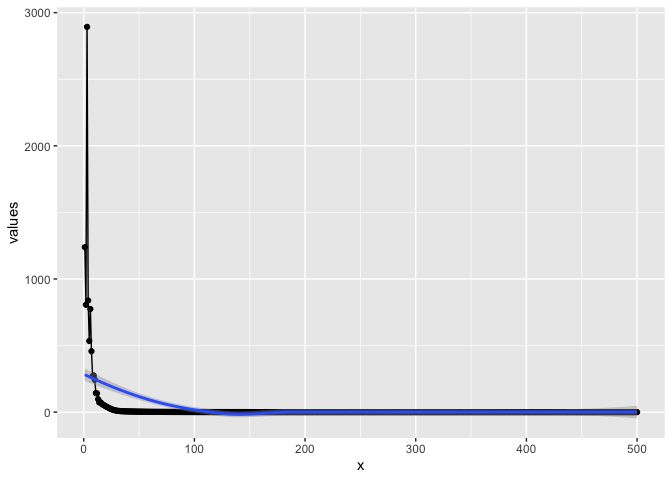

Setup
-----

First, we load the shared library.

      dyn.load(paste("../bnnlib", .Platform$dynlib.ext, sep=""))
      source("../bnnlib.R")
      cacheMetaData(1)
      
      source("../R/zzz.R")

This is the Mackey-Glass time series:

    x <- read.csv("../datasets/mackey-glass.dat")[,1]
    x <- x[seq(1,length(x),2)] # take every other
    dat <- data.frame(x=1:length(x),y=x)
    dat1 <- dat[1:500,]
    dat2 <- dat[500:1000,]
    library(ggplot2)
    ggplot(data=dat, mapping = aes(x=x,y=y) )+geom_line()+
      theme_minimal()+ ggtitle("Mackey Glass Series","Observations 1 to 500")

    ggplot(data=dat2, mapping = aes(x=x,y=y) )+geom_line()+ 
      theme_minimal()+ ggtitle("Mackey Glass Series","Observations 500 to 1000")

You can also embed plots, for example:

    ## NULL

    ## NULL

Train the network and plot training error

    #   trainer->abort_criteria.push_back( new ConvergenceCriterion(10e-7) );

    #Trainer_add_abort_criterion(trainer, ConvergenceCriterion(.0001), 1)

        Trainer_train2(trainer, training_set, 500)

    ## NULL

    #   GnuplotGenerator_plot_vector__SWIG_0("Training Error", Trainer_error_train_get(trainer))

    source("../R/plotTrainingerror.R")
    plotTrainingerror(trainer)

    ## `geom_smooth()` using method = 'loess' and formula 'y ~ x'

Forecasting the time-series

    sequence = SequenceSet_get(training_set,0)

     setClass("_p_std__vectorT_std__vectorT_double_std__allocatorT_double_t_t_p_std__allocatorT_std__vectorT_double_std__allocatorT_double_t_t_p_t_t", contains = 'ExternalReference')

    #predictor = AutoPredictor__SWIG_2(network, LinearTransferFunction() )
    #predictor = AutoPredictor__SWIG_2(network, LinearAddedNoiseTransferFunction(.1) )
    predictor = AutoPredictor__SWIG_2(network, LinearDampenedTransferFunction(.99) )

    time_steps <- 400
    context <- 200
    x = AutoPredictor_predict( predictor, sequence, time_steps, context)

    vals <- sapply(1:time_steps, FUN = function(index){getRow(x, index-1)})
    #getLength(x)
    plot(vals,type="l")

    #   AutoPredictor predictor2(network, new LinearTransferFunction() );
    #       predictor2.predict_and_plot( sequence, sequence->size(), 1000);

    x <- Network_activate_and_return_activations(network, sequence)
    num_nodes <- Network_get_num_nodes(network);
    ln <- Sequence_size(sequence)
    datfr <- matrix(NA, nrow=ln, ncol=num_nodes)
    for (i in 1:num_nodes) {
      rowdat<-  getRow(x,i-1)
     datfr[,i] <- rowdat
    }

    #nodenames <- Network_get_node_names(network)
    #getString(nodenames, 0)
