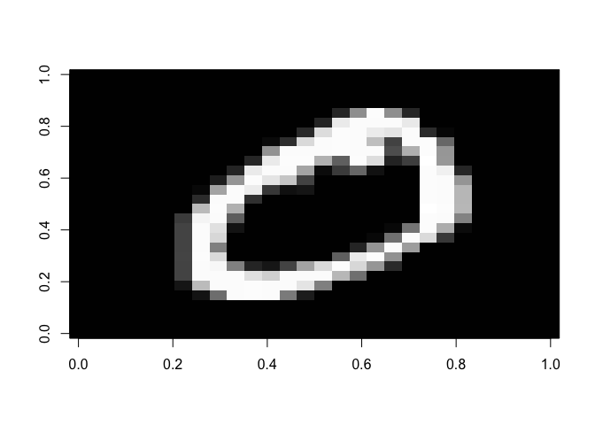
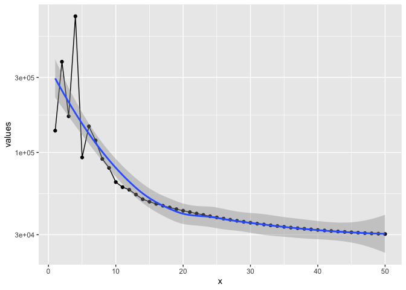
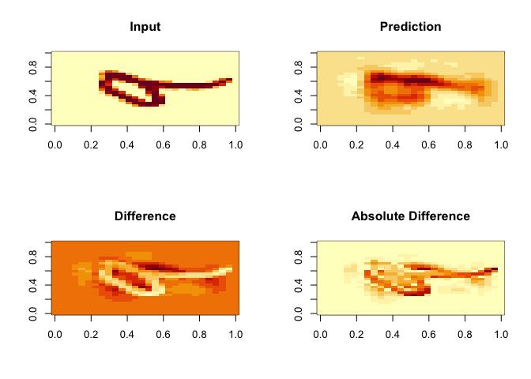
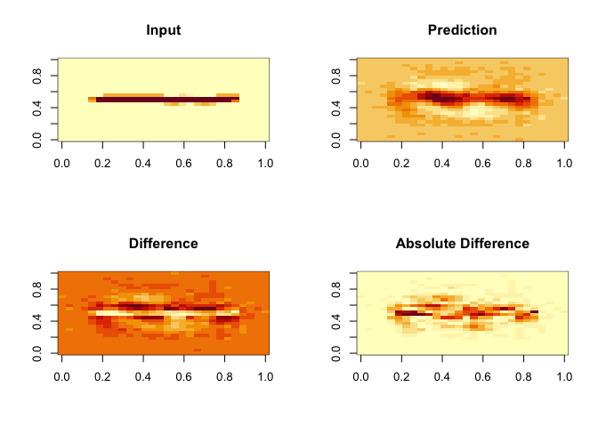
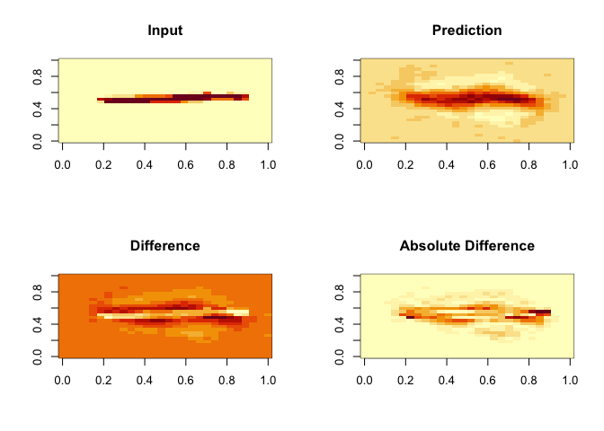
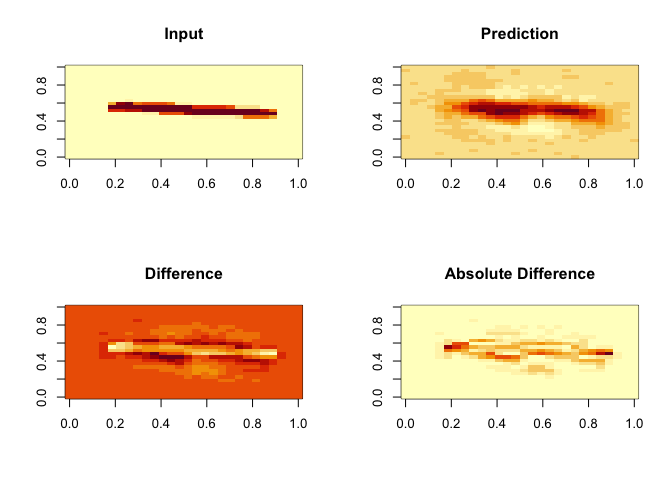
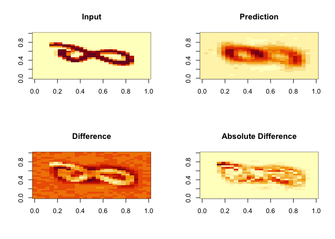
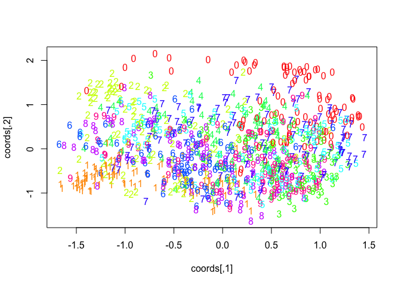

Load MNIST data
---------------

The MNIST dataset containts 70.000 hand-written digits. Each digit is
coded as 785 variables, that is, 28x28 pixel grey values and 1 label
encoding the digit.

    library(snedata)

    # fetch the MNIST data set from the MNIST website
    if (!exists("mnist"))
      mnist <- download_mnist()

    # view the fifth digit
    show_mnist_digit(mnist, 2)

Convert data
------------

Convert the first 1000 digits to `bnnlib` sequence format.

    library(bnnlib)

    ## Loading required package: ggplot2

    ## Loading required package: gridExtra

    seqset = SequenceSet()

    n_seq <- 1000

    for (i in 1:n_seq) {
      seq = Sequence()
      input_vals <- simplify2array(mnist[i,1:784]/256)
      target_vals <- bnnlib:::onehot(mnist[i,785], alphabet = 0:9)
    #  Sequence_add_from_array(seq, input_vals, target_vals, 784, 10)
      Sequence_add_from_array(seq, input_vals, input_vals, 784, 784)
      SequenceSet_add_copy_of_sequence(seqset, seq)
    }

    labels <-  mnist[1:n_seq, 785]

Train a network
---------------

One thousand digits with 200 epochs take about 90s on a 2020 laptop.

    dims<-784

    net_sparse <- NetworkFactory_createSparseAutoencoder(dims,10,0.1);

    bp <- ImprovedRPropTrainer(net_sparse)
    Trainer_sparsity_beta_set(bp, 0.1)

    ## NULL

    library(tictoc)
    tic()
    Trainer_train__SWIG_0(bp, seqset, 50)

    ## NULL

    toc()

    ## 25.998 sec elapsed

    library(ggplot2)
    plotTrainingerror(bp) + scale_y_log10()

    ## `geom_smooth()` using method = 'loess' and formula 'y ~ x'

Plot predictions
----------------

    plotPreds <- function(sequence, net, dim=28) {
      x = getOutputs(net, sequence )
      #x2 = sapply(1:(84*84), function(x){ Sequence_get_input_at(sequence,0,x-1)})
      x2 = getInputs(sequence)
      #getInputs()
      predimg <- matrix(nrow=dim, ncol=dim)
      inpimg <- matrix(nrow=dim, ncol=dim)
      for (i in 1:dim) {
        predimg[i,] <- x[1:dim+(i-1)*dim]
        inpimg[i,] <- x2[1:dim+(i-1)*dim]
      }
      
      par(mfrow=c(2,2))
      image(inpimg, main="Input")
      image(predimg, main="Prediction")
      image(predimg-inpimg, main="Difference")
      image(abs(predimg-inpimg),main="Absolute Difference")
    }

    plotPreds(SequenceSet_get(seqset,4), net_sparse)

    plotPreds(SequenceSet_get(seqset,102), net_sparse)

    plotPreds(SequenceSet_get(seqset,8), net_sparse)

    plotPreds(SequenceSet_get(seqset,40), net_sparse)

    plotPreds(SequenceSet_get(seqset,41), net_sparse)

Plot latent space projection
----------------------------

    pos <- which(sapply(getNodeNames(net_sparse) , function(x){startsWith(x,"Hidden")}))

    result <- matrix(nrow=0,ncol=length(pos))
    for (i in 1:SequenceSet_size(seqset)) {
      sequence <- SequenceSet_get(seqset,i-1)
      x = getActivations(net_sparse, sequence)[1,pos]
      result <- rbind(result, x)
    }

    result <- data.frame(result)

    cols <- rainbow(10)
    par(mfrow=c(1,1))
    if (sum(dist(result))!=0) {
      coords <- cmdscale(dist(result),2)
      plot(coords,type="n")
      text(x=coords[,1],y=coords[,2], labels=labels,col = cols[labels])
    }

Modify network
--------------

Remove input layer

    ens <- Network_get_ensemble_by_name(net_sparse, "Input")  
    Network_remove_ensemble(net_sparse, ens)
    Network_sort_nodes(net_sparse)
    Network_in_size_set(net_sparse, 10)

Create artificial inputs

      seq = Sequence()
      input_vals <- rep(0,10)
      Sequence_add_from_array(seq, input_vals, input_vals, 784, 784)

    getActivations(net_sparse, seq)
