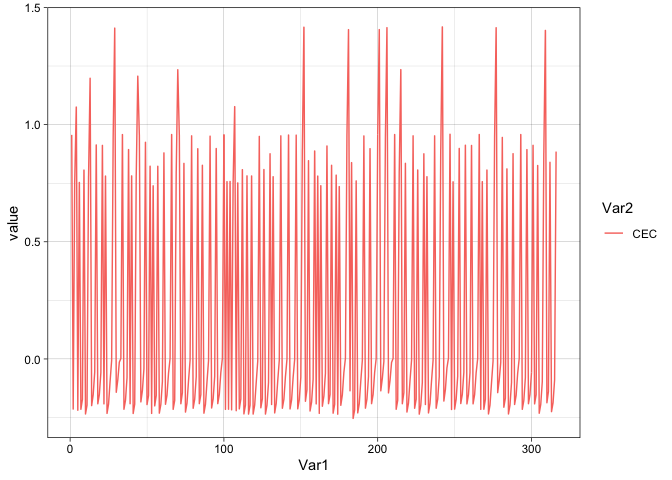
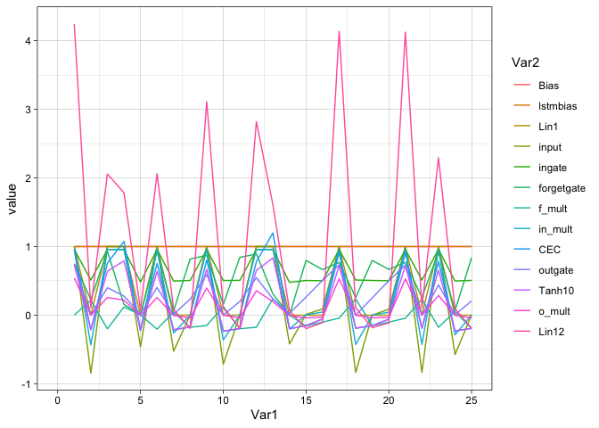

Introduction
============

This is a demonstration of the mean spike distance task by Gers et
al. (2002). The task is about learning a representation of time, which
involves counting discrete time steps, reading out the counter and also
learning to reset the timer when an external stimulus is present.

    setRandomSeed(92357)

    ## NULL

    # create network from Gers02a with LSTM hidden layer (including peepholes)
    # 1 output and 1 input
    #network = NetworkFactory_create_gers02a()
    network = LSTMNetwork(1,1,1, TANH_NODE, LINEAR_NODE)

Generate data

    set.seed(4598234)
    n <- 100
    interval.lengths <- 1:5
    #interval.lengths <- 1:10
    sequence_set <- SequenceSet()

    for (k in 1:10) {
    intervals <- sample(interval.lengths, size=n, replace=TRUE)
    input_seq <- c(1,rep(0, sum(intervals)))
    target_seq <- rep(0, sum(intervals)+1)
    input_seq[cumsum(intervals)+1] <- 1
    target_seq[cumsum(intervals)+1] <- intervals
    sequence <- toSequence(data.frame(input_seq, target_seq),1,2)
    SequenceSet_add_copy_of_sequence(sequence_set, sequence)
    }

Training
--------

    #trainer <- ADAMTrainer(network)
    #trainer <- ImprovedRPropTrainer(network)
    trainer <- ARPropTrainer(network)

    library(tictoc)
    tic()
    Trainer_add_abort_criterion__SWIG_0(trainer, ConvergenceCriterion(1e-3),10)

    ## NULL

    Trainer_train2(trainer, sequence_set, 500)

    ## NULL

    toc()

    ## 1.511 sec elapsed

    source("../R/plotTrainingerror.R")
    plotTrainingerror(trainer) + theme_light()

    ## `geom_smooth()` using method = 'loess' and formula 'y ~ x'

Predictions
-----------

    library(ggplot2)
    library(gridExtra)
    source("../R/plotPredictions.R")
    source("../R/plotActivations.R")
    plotPredictions(network, sequence) + theme_linedraw()

    ## NULL

Investigate activations
-----------------------

Plot all activations for the entire sequence.

    plotActivations(network, sequence) + theme_linedraw()

    plotActivations(network, sequence,"CEC") + theme_linedraw()

    plotActivations(network, sequence) + theme_linedraw()+xlim(0,25)

    ## Warning: Removed 3783 row(s) containing missing values (geom_path).

