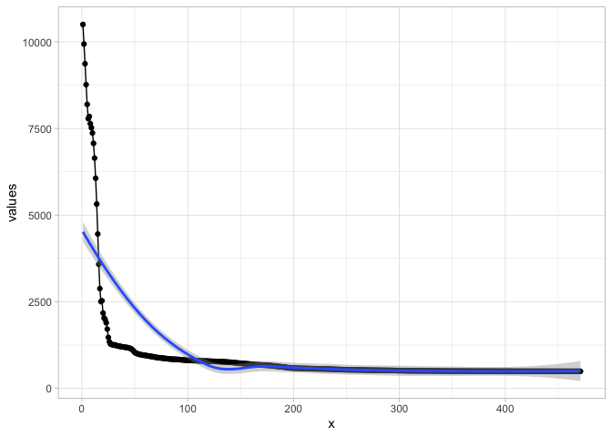

Introduction
============

This is a demonstration of the mean spike distance task by Gers et
al. (2002). The task is about learning a representation of time, which
involves counting discrete time steps, reading out the counter and also
learning to reset the timer when an external stimulus is present.

First, we load the library and some plotting libraries and set a random
seed for all bnnlib internals.

    library(bnnlib)

    ## Loading required package: ggplot2

    ## Loading required package: gridExtra

    library(ggplot2)
    library(gridExtra)
    library(tictoc)
    setRandomSeed(92357)

    ## NULL

We create the network from Gers02a with LSTM hidden layer (including
peepholes) with 1 output and 1 input.

    #network = NetworkFactory_create_gers02a()
    network = LSTMNetwork(1,1,1, TANH_NODE, LINEAR_NODE)

Generate data

    set.seed(4598234)
    n <- 100
    interval.lengths <- 1:5
    #interval.lengths <- 1:10
    sequence_set <- SequenceSet()

    for (k in 1:10) {
    intervals <- sample(interval.lengths, size=n, replace=TRUE)
    input_seq <- c(1,rep(0, sum(intervals)))
    target_seq <- rep(0, sum(intervals)+1)
    input_seq[cumsum(intervals)+1] <- 1
    target_seq[cumsum(intervals)+1] <- intervals
    sequence <- toSequence(data.frame(input_seq, target_seq),1,2)
    SequenceSet_add_copy_of_sequence(sequence_set, sequence)
    }

Training
--------

    #trainer <- ADAMTrainer(network)
    trainer <- ImprovedRPropTrainer(network)
    #trainer <- ARPropTrainer(network)

    tic()
    Trainer_add_abort_criterion__SWIG_0(trainer, ConvergenceCriterion(1e-3),10)

    ## NULL

    Trainer_train2(trainer, sequence_set, 500)

    ## NULL

    toc()

    ## 1.645 sec elapsed

    plotTrainingerror(trainer) + theme_light()

    ## `geom_smooth()` using method = 'loess' and formula 'y ~ x'

Predictions
-----------

Plot the network predictions zoomed in to the first 25 steps of the
sequence.

    plotPredictions(network, sequence) + theme_light()

    ## NULL

Investigate activations
-----------------------

Plot all activations for the entire sequence.

    plotActivations(network, sequence) + theme_light() +   coord_cartesian(xlim=c(0,25))

    plotActivations(network, sequence,"CEC") + theme_light() +   coord_cartesian(xlim=c(0,25))

    plotActivations(network, sequence) + theme_light() +   coord_cartesian(xlim=c(0,25))

