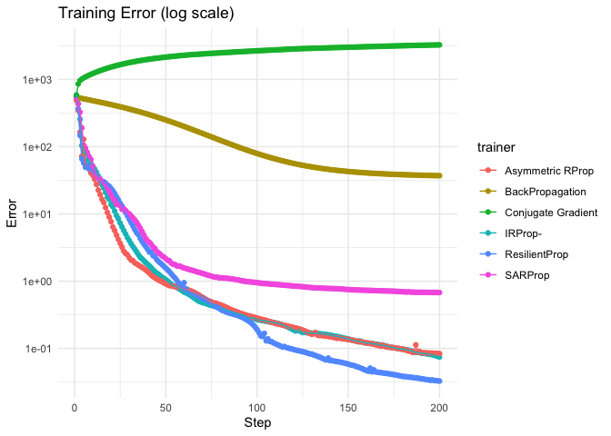

In this document, we will compare the convergence of different training
algorithms for a given dataset and network architecture. The data will
be simulated from a simple toy problem, in which there are four i.i.d.
Gaussian predictors and a single continuous outcome.

Load Library
------------

First, we load `bnnlib`’s shared library.

      dyn.load(paste("../bnnlib", .Platform$dynlib.ext, sep=""))
      source("../bnnlib.R")
      cacheMetaData(1)

Generate Data
-------------

Next, we simulate some data in a `data.frame` and convert this to bnn’s
Sequence format:

    N <- 100 # number of rows
    M <- 5 # number of columns
    simdata <- data.frame(matrix(data=rnorm(N*M),nrow = N))
    simdata[,M] <- simdata[,1]+simdata[,2]-ifelse(simdata[,3]>0,2,0)

    source("../R/toSequence.R")
    set <- SequenceSet()
    seq <- toSequence(simdata,1:4,5)
    SequenceSet_add_copy_of_sequence(set, seq)

    ## NULL

This is a sanity check, whether the input and output size is correct.

    Sequence_get_target_size(seq)

    ## [1] 1

    Sequence_get_input_size(seq)

    ## [1] 4

Create Network
--------------

Now, we create a feed-forward network with a single hidden layer of 10
neurons.

    LINEAR_NODE = 3 #this is a bnnlib constant

    net <- NetworkFactory_createFeedForwardNetwork(M-1,10,1,LINEAR_NODE)

Trainer
-------

Let’s generate a list of different training algorithms and run them each
for 100 steps. Save the results in `err.data`:

    sarp <- SARPropTrainer(net)
    SARPropTrainer_temperature_set(sarp, .9)

    ## NULL

    trainer <- list(CGTrainer(net), BackpropTrainer(net), ImprovedRPropTrainer(net),
    ARPropTrainer(net) ,  RPropTrainer(net), sarp)

    steps <- 100
    err.data <- matrix(data=NA,nrow=length(trainer)*steps,ncol=3)
    err.data <- data.frame(err.data)
    names(err.data) <- c("error","trainer","step")
    k <- 1

    for (i in 1:length(trainer)) {
      tt <- trainer[[i]]
      Network_reinitialise(net)

      for (j in 1:steps) {
        Trainer_train__SWIG_0(tt, set, 1)
        err.data[k,1] <- Network_evaluate_training_error__SWIG_0(net, set)
        err.data[k,2] <- Trainer_get_name(tt)
        err.data[k,3] <- j
        k<-k+1
      }
    }

    err.data$trainer<-factor(err.data$trainer)

Plot the errors of the different training algorithms on top of each
other.

    library(ggplot2)

    ggplot(data=err.data, 
           aes(x=step,y=error,group=trainer,col=trainer))+
      geom_point()+
      geom_line()+
      theme_minimal()

